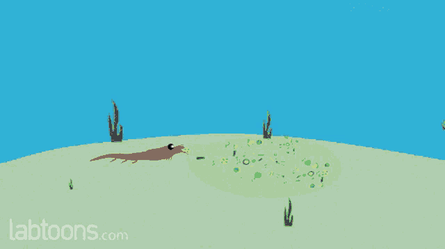

# Seasonal variance in green and brown energy pathways in food webs across an ecosystem gradient

## Abstract
Food webs typically include highly coupled fast, ‘green’ energy pathways driven by algae or other primary producers and slower, ‘brown’ energy channels driven by detritus. Quantifying energy consumers, and whole communities, obtain from each of these pathways is essential, particularly across multiple interconnected food webs over large spatial scales, because energy dynamics are known to influence ecosystem structure and function. Food web structure and function are spatially and temporally dynamic, yet few studies track variance in energy channel contributions to aquatic food webs across an ecosystem gradient of interconnected habitats during distinct hydrologic seasons. In this study, we used Bayesian stable isotope mixing models to quantify mean seasonal contributions of brown and green energy pathways to nine aquatic food webs across two river drainages in the Florida coastal Everglades. Sites span an ecosystem gradient of freshwater marsh, riverine mangrove, and marine seagrass habitats. We found that green energy channels were the dominant pathway for most food webs across both coastal drainages regardless of site and season, but there were notable exceptions and seasonal switching of the dominant energy pathway was observed in both systems. Spatially there were contrasting trends between river networks. Shark River Slough food webs relied less on green pathways downriver except for the Lower River site during the dry season. In contrast, food webs further downriver and away from shore in Taylor Slough increased reliance on green energy pathways except for the Mid Bay site during the wet season. Seasonal shifts in the proportional contribution of energy channels and individual basal resources varied across sites, highlighting the complexity of food web energy dynamics over broad spatiotemporal scales. Our findings provide a general view of energy dynamics in aquatic communities across the Everglades, but continued research will allow us to better predict how species, food webs, and ecological networks may respond to environmental drivers under future global change.

## Authors

- James W. Sturges
- W. Ryan James
- Ryan J. Rezek
- Rolando O. Santos
- Mack White
- Gina A. Badlowski
- Shakira Trabelsi
- Jordan Massie
- James Nelson
- Joel C. Trexler
- Jennifer S. Rehage

## Affiliations

1. Department of Earth and Environment, Institute of Environment, Florida International University, 11200 SW 8th Street Miami, FL 33199
2. Department of Biological Sciences, Institute of Environment, Florida International University, 11200 SW 8th Street Miami, FL 33199
3. Department of Marine Science, Coastal Carolina University, 100 Chanticleer Dr E, Conway, SC 29528
4. Department of Marine Sciences, University of Georgia, 325 Sanford Drive, Athens, GA 30602
5. Department of Biological Science, Florida State University, 319 Stadium Drive Tallahassee, FL 32306

## Corresponding Author

- James W. Sturges; Email: [jstur015@fiu.edu](mailto:jstur015@fiu.edu)

## Manuscript Highlights

- Green energy pathways support most aquatic food webs across an ecosystem gradient.
- Seasonality induces site- and source-specific changes to food web energy dynamics.
- Energy pathways are expected to be driven by nutrient dynamics and hydrology.

## Keywords

- basal resource
- ecosystem function
- energy dynamic
- environmental gradient
- food web coupling
- stable isotopes
- resource use

## Acknowledgments

We thank our collaborators at Everglades National Park for their continued support of our research. Funding for this project was supported by the National Science Foundation through the Florida Coastal Everglades Long-Term Ecological Research (FCE-LTER) program under grant No. DEB-1832229. The authors declare no conflict of interest. This is contribution #X from the Coastline and Oceans Division in the Institute of Environment at Florida International University.

---

## Gif Section

